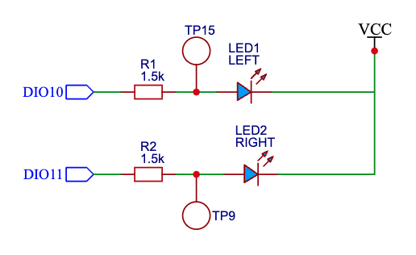
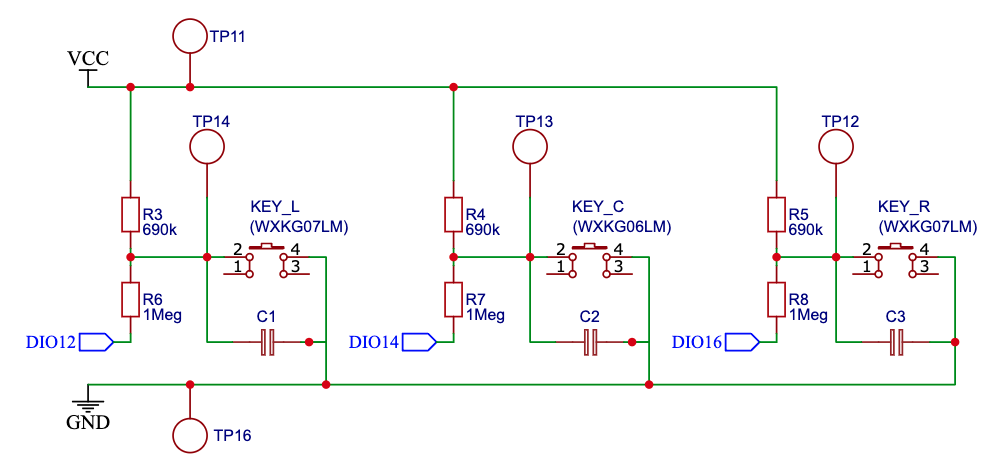

- [Overview](#overview)
- [Getting Started](#getting-started)
- [Device](#device)
  - [Board](#board)
  - [Circuit diagrams](#circuit-diagrams)
- [JN5169 Documentation](#jn5169-documentation)

# Overview
**WXKG07LM** and **WXKG06LM** come with a very limited feature set and uses the JN5169 chip. This repository aims to develop custom firmware to replace the original and improve functionality.

Pre-built firmwares can be found in the [zigbee-custom-firmwares](https://github.com/mgavryliuk/zigbee-custom-firmwares) repository.

# Getting Started
This project uses VS Code and [Dev Containers](https://code.visualstudio.com/docs/devcontainers/containers) for development and building.
1. Install [Visual Studio Code](https://code.visualstudio.com/).
2. Follow the [Dev Containers tutorial](https://code.visualstudio.com/docs/devcontainers/tutorial) and open the project in the remote environment.
3. Download SDK `JN-SW-4170` from NXP site and add into sdk directory.
4. Click the `Build` button to compile the project.

# Device
`WXKG07LM` and `WXKG06LM` share the same board but has diferent buttons soldered.

**WXKG07LM DIOs definition:**
- Left LED - DIO 10
- Right LED - DIO 11
- Left button - DIO 12
- Right button - DIO 16

**WXKG06LM DIOs definition:**
- Left LED - DIO 10
- Right LED - DIO 11
- Button - DIO 14

## Board
Version: LM15-WS R1.1 

## Circuit diagrams
LEDs circuit:  

Buttons circuit: 

# JN5169 Documentation
[Product page](https://www.nxp.com/products/JN5169) 
[Support Resources for JN516x MCUs](https://www.nxp.com/products/wireless-connectivity/zigbee/support-resources-for-jn516x-mcus:SUPPORT-RESOURCES-JN516X-MCUS) 
[JN516x/7x Zigbee 3.0](https://www.nxp.com/pages/jn516x-7x-zigbee-3-0:ZIGBEE-3-0) 
[Data Sheet: JN516x](docs/files/JN516X.pdf) 
[Data Sheet: JN5169](docs/files/JN5169.pdf) 
[IEEE 802.15.4 Stack (JN-UG-3024)](docs/files/JN-UG-3024.pdf) 
[ZigBee 3.0 Stack (JN-UG-3113)](docs/files/JN-UG-3113.pdf) 
[ZigBee 3.0 Devices (JN-UG-3114)](docs/files/JN-UG-3114.pdf) 
[ZigBee Cluster Library (for ZigBee 3.0) (JN-UG-3115)](docs/files/JN-UG-3115.pdf) 
[JN51xx Core Utilities (JN-UG-3116)](docs/files/JN-UG-3116.pdf) 
[JN516x Integrated Peripherals API (JN-UG-3087)](docs/files/JN-UG-3087.pdf) 
[JN51xx Production Flash Programmer (JN-UG-3099)](docs/files/JN-UG-3099.pdf) 
[JN51xx Boot Loader Operation (JN-AN-1003)](docs/files/JN-AN-1003.pdf)
