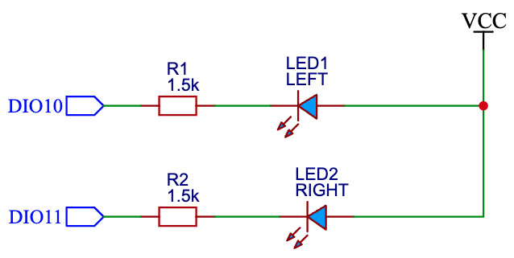
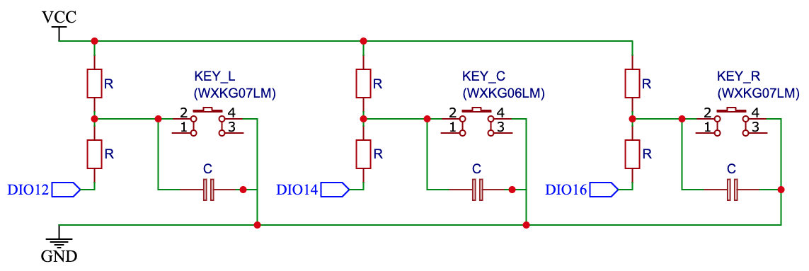

- [Overview](#overview)
  - [DIOs definition](#dios-definition)
  - [Board](#board)
  - [Circuit diagrams](#circuit-diagrams)
- [Build](#build)

# Overview
[WXKG06LM](https://www.zigbee2mqtt.io/devices/WXKG06LM.html) - Wireless remote switch D1 (single rocker). It uses the same circuit board as the `WXKG07LM` but comes with only the center button soldered.

## DIOs definition
- Left LED - DIO 10
- Right LED - DIO 11
- Button - DIO 14

## Board
Version: LM15-WS R1.1

## Circuit diagrams
LEDs circuit:  

Buttons circuit: 

# Build
To build firmware for this device, select preset `WXKG06LM` in CMake configuration.
